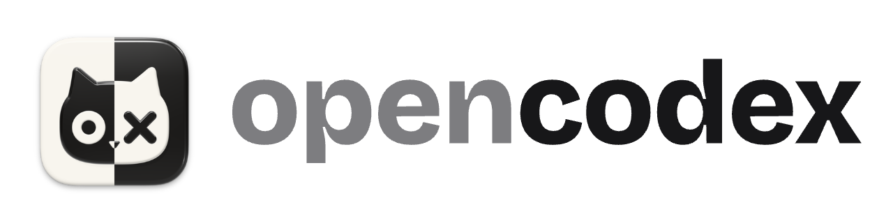
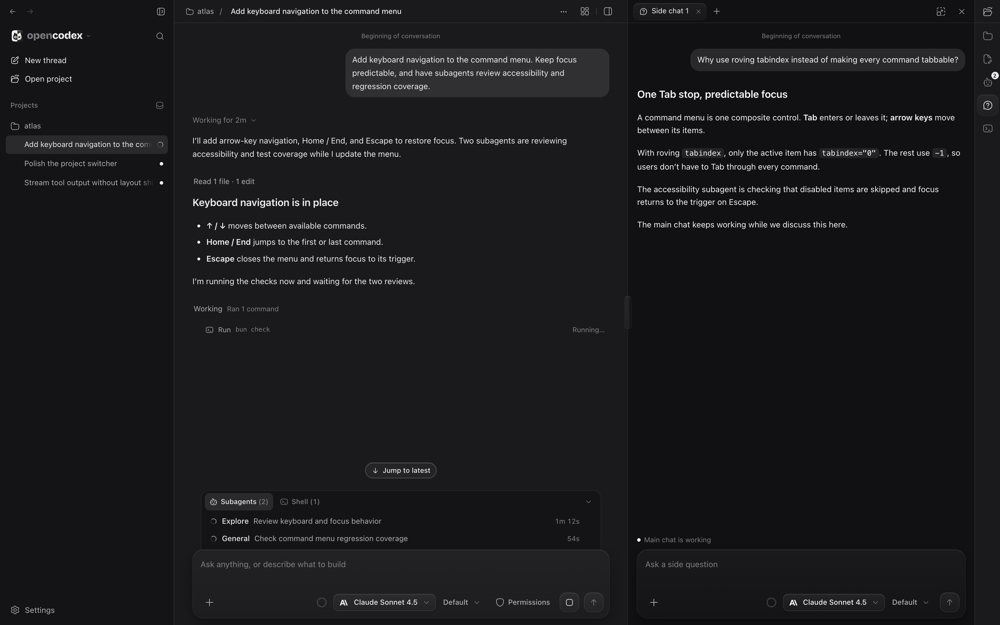

<picture>
  <source media="(prefers-color-scheme: dark)" srcset="docs/images/opencodex-dark.png">
  <source media="(prefers-color-scheme: light)" srcset="docs/images/opencodex-light.png">
  
</picture>

# OpenCodex

[Documentation for agents](docs/readme.md)

This is my attempt to bring one of the greatest coding-agent UXs (Codex) to [OpenCode](https://opencode.ai/). The OpenCode harness is my go-to, but its desktop UI lacks some features I want, like sidechat, annotations, and a subagent view. It takes lots of inspiration from good software like

- [t3code](https://t3.codes/)
- [openchamber](https://openchamber.dev/)
- [opencode desktop](https://opencode.ai/)
- [Codex](https://openai.com/codex/)

This is not a T3 Code alternative / fork. It uses OpenCode as the backend and acts as a GUI with some basic plugins. Models and providers configured in OpenCode are available here. An experimental [Claude Code bridge](docs/readme.md#claude-code-subscriptions) lets your installed Claude CLI serve as an OpenCode provider.

It currently supports:

- **Sidechat** — ask questions from the main chat's context without interrupting its work. Quote a response into a sidechat; an optional live-context plugin lets it check the main chat's latest progress.
- **Subagent view** — follow delegated sessions and open their conversations, including pending approvals and questions.
- **Running activity** — see running subagents and shell commands right in the main chat, with expandable tool details and shell output.
- **Focus view** — keep threads that need you, running work, and recent conversations together; pin threads or mark them done.
- **Annotations** — comment on responses or diff lines and send that feedback with your next message.
- **Workspace tools** — browse and edit files, review changes, and use project terminals without leaving the app.
- **Themes** — light and dark palettes, customizable colors, and separate styling for code surfaces.

_The actual UI with demo conversation data: the main chat runs checks and subagents while a sidechat explains a design decision._

## Try it

[Download for macOS](https://github.com/KMKoushik/opencodex/releases/latest). Requires [OpenCode 2.x](https://opencode.ai/v2/docs/) installed and configured. See the [installation notes](docs/release.md#first-installation) for macOS's first-launch warning.

For running the web app or building from source, see [the docs](docs/readme.md#develop).

The logo and initial design are by [godwhoa](https://github.com/godwhoa).
