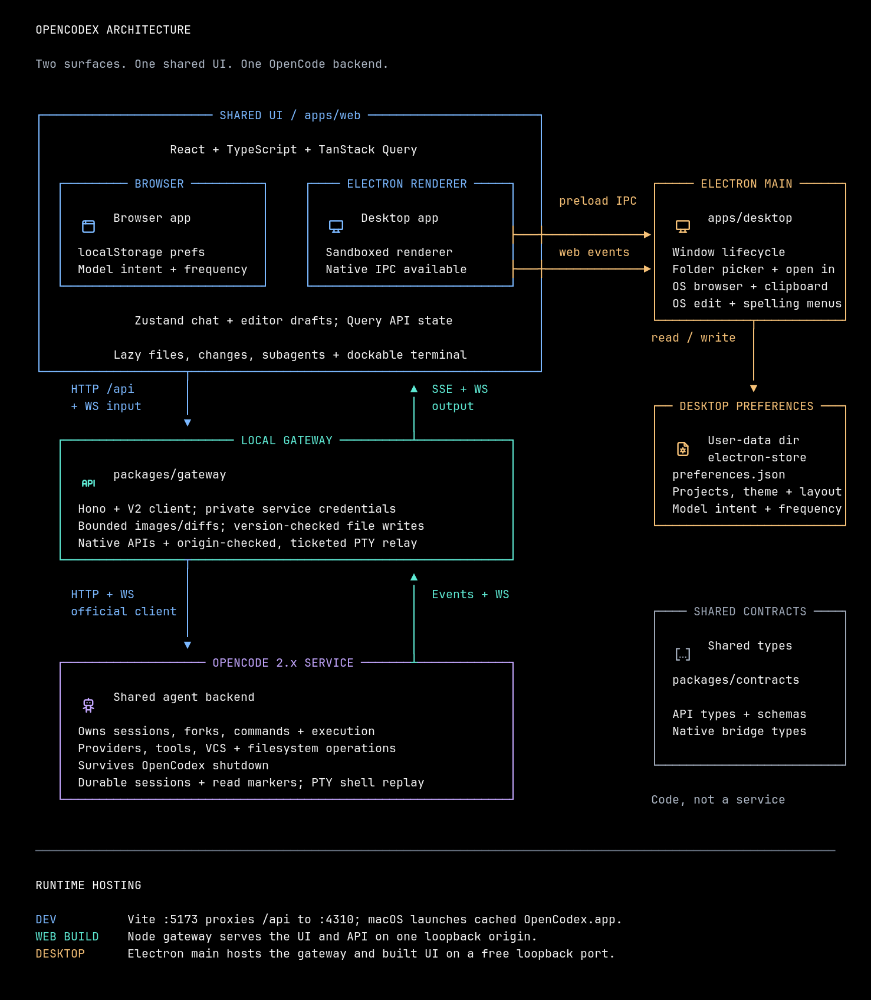

# Architecture



This is the project's single maintained architecture diagram. It shows implemented behavior, not a future feature plan.

## Reading the diagram

**Audience:** contributors working across the web, desktop, and backend boundaries.

**Main claim:** browser and Electron share the React UI and gateway API; Electron adds native capabilities, while OpenCode owns the agent runtime and durable sessions.

The common path runs downward: shared UI → local gateway → OpenCode. Upward arrows carry native events for live text and snapshot refresh, plus terminal output over WebSocket; terminal input follows the downward path. Ordinary HTTP responses return on their request connection and are omitted for clarity. The desktop-only side branch uses preload IPC for the native bridge and web-content events for OS link, editing, and spelling menus.

| Source                | Action                                                                                  | Target                                                |
| --------------------- | --------------------------------------------------------------------------------------- | ----------------------------------------------------- |
| Shared React UI       | Reads projects, models, and messages; selects models; sends prompts and replies         | Local gateway                                         |
| Local gateway         | Discovers or connects with the official client; delegates native operations             | OpenCode service                                      |
| Local gateway         | Reads video metadata/ranges and validates canonical reveal targets (local service only) | Existing files on the gateway host                    |
| Local gateway         | Checks plan limits with local sign-ins (local service only); returns only percentages   | ChatGPT, Anthropic, and OpenCode Go usage APIs        |
| OpenCode service      | Streams native session, catalog, project, permission, and form events                   | Gateway, which forwards them to the UI                |
| Electron renderer     | Calls native capabilities through preload IPC                                           | Electron main process                                 |
| Electron main process | Reveals an explicitly selected file through the OS shell                                | Native file manager                                   |
| Electron main process | Reports native fullscreen transitions through preload IPC                               | Renderer titlebar spacing                             |
| Electron main process | Checks and explicitly downloads update artifacts over HTTPS                             | Public GitHub Releases feed                           |
| Electron main process | Reports update state through origin-checked preload IPC                                 | Renderer sidebar and General settings                 |
| Electron web contents | Emits link-opening and context-menu events                                              | Main, which owns OS link, editing, and spelling menus |
| Electron renderer     | Hosts browser panel pages as `<webview>` guests; receives popup/new-tab requests        | Main, which locks down each guest as it attaches      |
| Electron main process | Reads and writes project, appearance, layout, and model/thinking preferences            | App user-data directory                               |
| Browser UI            | Reads and writes project, appearance, layout, and model/thinking preferences            | Browser localStorage                                  |

`packages/contracts` is shared source code, not another running service. It validates app-owned inputs and re-exports OpenCode's generated response/event types without loading the client runtime into React. Desktop and web use its native bridge types. In built desktop mode, the gateway runs inside Electron's main process. In web mode, Node hosts it. Development uses a separate gateway process for either UI surface.

On macOS, the desktop development config launches an ad-hoc-signed `OpenCodex Dev.app` copy cached under `apps/desktop/node_modules/.cache/opencodex-electron`, with a separate bundle ID and a blue DEV-ribbon icon. macOS reads its bundle name and icon for Mission Control and the Dock; `app.setName` alone only changes Electron's internal name. The installed Electron bundle stays intact, relative framework symlinks are preserved, and the executable retains its `Electron` name so development mode still works. Cache identity follows the installed executable, product name, and development icon contents. The main process preserves the existing user-data path when setting its display name. Packaged builds retain OpenCodex's production name, icons, and app ID. Vite's development flag controls the shared UI's Dev badge, branding, document title, and favicon, without new IPC or backend state. Regenerate the development artwork on macOS with `swift scripts/dev-icon.swift`.

Packaged apps opened from Finder or the Dock inherit launchd's minimal `PATH`, which cannot find an `opencode` installed through a shell profile, and a service the gateway starts passes that environment to agent tools. The main process therefore reads `PATH` and a few locale/Homebrew variables from the user's login shell once (5-second timeout, with `~/.opencode/bin`, Homebrew, and `~/.local/bin` fallbacks), starting while Electron initializes and finishing before the gateway starts; development runs from a terminal and skips it. Releases follow T3 Code's artifact pattern without its backend staging step, since the gateway is already bundled into the main process: `.github/workflows/release.yml` builds arm64 and x64 DMGs and updater ZIPs with electron-builder on a disposable macOS runner and publishes them with update manifests to a GitHub Release for `v*` tags. Builds require the stable self-signed certificate in Actions secrets. Only the disposable runner trusts it; developer and end-user trust settings remain untouched. This is not Apple notarization, so the initial install still needs a Gatekeeper override. See `docs/release.md`.

OpenCode remains the same externally owned service across UI reconnects and app shutdown. A failed event stream reconnects and triggers a fresh snapshot; polling covers stream recovery. An explicit `OPENCODE_URL` replaces local discovery. Neither path moves service credentials into the renderer. Explicit folder opening validates paths on the gateway machine; native session/worktree operations resolve locations on the OpenCode host.

## Ownership decisions

- **Worktrees:** Codex and T3 choose a thread's checkout beside the composer before its first message; OpenCodex follows that flow on the pinned V2 client's native `worktree.list/create/remove`, `vcs.branch.list`, and `session.move`, without their app-owned Git workers, thread/worktree records, setup scripts, or automatic cleanup. Under an unsent chat's composer, a workspace bar offers **Local** or **New worktree** plus a searchable starting branch (default: the local checkout's HEAD). The first send calls one gateway route that checks the chat is empty and idle, creates a detached worktree from the chat's folder (`from` is a source directory, `branch` a starting ref), moves the same session into it, and waits for OpenCode to report the new location before the prompt is sent; a failed move removes the unused checkout. The session ID, draft, and model therefore stay the same, and no empty chat is left behind. Once a chat has messages, the bar only shows Local or the worktree name and its branch. OpenCodex never moves a chat with history; Codex's Handoff (moving code and chat together) is not implemented. Session location remains authoritative for files, models, tools, and terminals.

  The sidebar keeps the project's folder-scoped thread list primary, because older threads can carry a previous native project ID, and merges in threads from the project's other checkouts via `session.list({ project })`, marked with a worktree icon. Worktrees are listed and removed from **Settings → Projects → Manage worktrees**. Removal always passes `force: false` and only accepts a registered native Git worktree. The gateway refuses while a chat, terminal, or shell there is running, and Git refuses uncommitted changes. Idle chats in a removed worktree remain readable but cannot send. These checks are advisory across clients because V2 has no checkout lease. Session create/list send validated directories directly to OpenCode, so worktrees work on an externally connected service. Worktree events invalidate project-scoped Query snapshots, and reconnecting rereads them.

- **Claude Code provider bridge:** T3 Code's `ClaudeAdapter` uses the official Agent SDK's `query()` with the installed Claude executable, resume IDs, and `canUseTool`, owning a separate agent runtime. OpenCodex instead installs an opt-in OpenCode V2 plugin. `packages/claude-code-plugin` pins `@khalilgharbaoui/opencode-claude-code-plugin` at 0.40.0 and wraps its native `provider.transform`/`aisdk.hook` integration with our tool-routing preset and lifecycle adapter. The plugin runs the user's unmodified `claude --print`; the gateway never runs Claude or handles its credentials.

  The preset forwards native V2 schemas for filesystem/shell operations, subagents, questions, skills, web tools, Code Mode `execute`, and side-chat context tools. Corresponding Claude workspace built-ins are disabled. Claude's headless permission bypass allows reaching the proxy; OpenCode checks and executes forwarded operations under native session permissions. Direct MCP bridging is disabled and Claude's MCP config is strict, preserving OpenCode's connections and credentials. Other direct plugin tools require explicit forwarding. Claude retains an internal agent loop and transcript files; OpenCode owns app-visible history, admission, steering, forks, and tool results. Workers expire after five idle minutes. Persistent resume mappings, native Claude forks, and extra automatic continuation are disabled so recovery uses OpenCode history.

  Live experiments found upstream 0.40.0 could consume a new prompt while completing a previously rejected tool turn, or drop a steer while resuming parked tool results. The wrapper translates native execution interruption, rejected permissions, and inbox delivery during a running turn into upstream worker-disposal notifications on its **private** iterator; it never publishes a session deletion or removes native sessions. A transient set tracks only running Claude sessions, clearing on idle/deletion/interruption. Ordinary idle follow-ups retain worker reuse; recovery reconstructs context from OpenCode history. Upstream reconstruction clips older messages to 2,000 characters each and serializes tool results and current user text into one CLI envelope, so recovery/forks are not lossless replay and a model can misinterpret role boundaries. Recheck this pinned compatibility shim on upgrades. Context management and usage reporting remain adapter-specific.

  A pinned Bun dependency patch fixes upstream's detached-output replay: it opens a warning/text block only for actual late narration, an error message, or a buffer-overflow report. Progress/usage/protocol frames still update the adapter's state without generating empty "between turns" messages. Genuine late replies retain their provenance marker; React does not hide or rewrite saved messages. The subprocess regression exercises both housekeeping and real late output. Reassess the patch when upgrading the dependency.

  `bun claude-code-plugin` embeds the patched bundle and dependency licenses in the gateway; `bun check` verifies freshness. Settings installs `plugins/opencodex-claude-code/index.js` in the local OpenCode config directory. V2 exposes plugin inventory/update but no install/remove API for a bundled local artifact (`config.update` only changes the shell), so OpenCodex owns this narrow filesystem fallback. Writes are atomic and serialized per gateway, and content hashes protect customized files; there is no cross-gateway compare-and-swap. Explicit external connections disable installation. Query owns status/mutations, the existing model catalog feeds the picker, and closing the app never stops OpenCode.

- **Plan limits:** Settings → Usage shows the remaining share of each subscription window, with reset countdowns and a pace marker comparing usage with elapsed window time. The pinned V2 client has no quota or usage-limit operation (its `session.usage.*` events are per-session token counts), and plugins cannot serve routes, so the gateway owns a narrow read-only fallback modeled on Zeron's usage probes. OpenCode stays authoritative for which credential is active: `integration.get` names the `openai` and `opencode-go` connections, and only that credential ID is read from OpenCode's local SQLite store (`OPENCODE_DB`, else the most recently written `opencode*.db` in its data directory) through `node:sqlite` in read-only mode. ChatGPT OAuth sign-ins query `chatgpt.com/backend-api/wham/usage` (API-key connections have no plan windows); Go keys query `opencode.ai/zen/go/v1/usage` for its 5-hour, weekly, and monthly windows. Claude follows the Claude Code bridge's own login, read from the macOS Keychain item `Claude Code-credentials` (suffixed per `CLAUDE_CONFIG_DIR`) or `.credentials.json`, and queries Anthropic's OAuth usage endpoint. The gateway never refreshes or writes tokens, because OpenCode and Claude Code rotate single-use refresh tokens; an expired token reports that its owner refreshes it on next use. Secrets never reach the renderer, upstream bodies are capped at 1 MiB, and each provider fails independently. It is enabled only for a locally discovered loopback service, never `OPENCODE_URL`. Query owns the snapshot (60-second stale time, five-minute refresh while mounted, explicit refresh); the countdown re-renders once a minute. The OpenCode database schema and these vendor endpoints are not public contracts, so recheck them when upgrading. No cache, persistence, or Electron bridge is added.

- **Video/PDF playback and file reveal:** recognized video extensions open a native HTML video player with play/pause, seek, volume, and fullscreen controls, without autoplay. `.pdf` files open in Chromium's built-in PDF viewer inside an iframe (Electron enables it with `webPreferences.plugins`), so PDFs of any size render without the 2 MiB editor limit. Only the active document owns a player or viewer; hiding/closing/switching releases it. Query reads lightweight media metadata through the existing file-preview route; playback uses same-origin `/api/workspace/media` with GET/HEAD, byte ranges, correct lengths, suffix ranges, and explicit 416 responses. The pinned V2 `file.read` client and native handler buffer an entire file and expose no range/streaming operation (`packages/server/src/handlers/fs.ts` in the reference), so OpenCodex owns a narrow read-only host-file fallback. It is enabled only with a locally discovered loopback service, never for `OPENCODE_URL`, including loopback overrides. Canonical directory containment rejects traversal and escaping symlinks; regular-file checks and no-follow/nonblocking opens reject special files and leaf symlink swaps. File-handle streams use 64 KiB chunks and backpressure, close on cancellation/shutdown, and add no media cache, transcoder, whole-file allocation, or larger editor limit. Format/codec support remains the browser's; failures show Retry and suggest the native file manager. The desktop file toolbar offers Show in Finder/File Explorer/Files for any selected file, including previews too large to edit. It resolves a canonical local target through `/api/workspace/file-location`, then uses the origin-checked `revealFile` preload operation and Electron `shell.showItemInFolder`; it does not execute files. Browser builds omit the OS action. The existing project-level Open in app menu is unchanged. This does not move ordinary filesystem operations, agent execution, or durable state out of OpenCode.

- **Browser panel (desktop):** following T3 Code's preview browser, the desktop workbench has a Browser panel whose tabs are Electron `<webview>` guests. The pinned V2 client and OpenCode's own app have no in-app browser, so this is OpenCodex-owned presentation with no gateway or OpenCode involvement. Electron main enables `webviewTag` and, on `will-attach-webview`, rejects any guest outside the `persist:opencodex-browser` partition or with a non-web URL, strips preloads, and forces `sandbox`, `contextIsolation`, no Node integration, web security, and no nested webviews; guests cannot reach the preload bridge. The partition is a persistent profile separate from the app's storage, keeps Chromium's native user agent, and grants only `clipboard-sanitized-write`. Guests navigate only to http(s); popups and the guest menu's Open Link in New Tab go through one main→renderer IPC event and become tabs after their opener. Moving or hiding a `<webview>` restarts its page, so one app-level host renders every live page as a fixed overlay positioned over the visible panel's slot (ResizeObserver plus window resize) and parks the rest offscreen, keeping pages alive across panel and thread switches; at most four pages stay live, and an evicted page reloads from its saved URL when shown. Tab lists and URLs are per-thread workbench presentation state saved through the existing preference storage (at most 12 tabs); titles, loading, history, and errors are runtime-only. Load failures and crashes show the panel's own message with Try again. Local links in chat (`localhost`, loopback, and `*.localhost`) open in the panel like Codex; Cmd/Ctrl-click and other links use the system browser. Browser builds omit the panel. There is no automation, element picking, recording, or agent access to pages.
- **Page comments (desktop):** following T3 Code's preview annotations, the Browser panel's comment button opens Select, Region, Draw, and Erase tools inside the page. T3 Code injects a guest preload with context isolation off; OpenCodex keeps guests preload-free. Electron main validates that the requested page is a `<webview>` of the calling window in the browser profile, then runs a self-contained overlay with `executeJavaScriptInIsolatedWorld`, which shares the page's DOM but not its JavaScript. The overlay draws in a closed shadow root, styles itself with constructed stylesheets so page CSP cannot block it, swallows page clicks while open, and bounds its result (20 elements; 500-character selector/HTML excerpts). Main schema-checks that result as untrusted, crops `capturePage` to the marks (5 s timeout, at most 2000 px), and closes the overlay. Navigation, crash, or close cancels it. The renderer adds the comment as a page-targeted review comment and the PNG as an ordinary draft attachment, so both use the existing draft limits and are sent as prompt text plus a file part.

- **Combined running-activity tray:** the composer has one shared tray with `Subagents (N)` and `Shell (N)` tabs, following the OpenCode TUI's grouped background activity instead of stacking two cards. Both counts and subagent permission/question indicators stay visible while switching tabs or collapsing the list; only the expanded selected list mounts elapsed tickers. The initial tab prefers running subagents, otherwise Shell; explicit tab choices and the shared disclosure remain session-local React state. Arrow keys and Home/End move focus and activate tabs. The body fits the larger running count up to four rows, giving both tabs identical geometry without wasting a full-height panel on one command. Counts and request indicators reuse the existing native Query observers, even on hidden tabs; shell output still reads only while its dialog is open. The parent chat's shells and its running direct children keep their existing scopes—this does not aggregate children's commands. No new transport, polling loop, execution owner, or persistence is introduced.

- **Running agent shells:** a compact tray above the composer follows OpenCode V2's native shell catalog, filtering by `metadata.sessionID` and `status: 'running'`, just like the pinned client's session-shell selector. It stays visible even when the parent agent is idle: background processes are not completed tool-call counts or the user-created PTYs in Terminal. Directory-scoped `/api/shells` routes delegate list/get/output/remove to the official client. Native `shell.created/exited/deleted` events are forwarded through existing SSE and coalesced into shell-only Query refreshes; reconnect rereads authoritative snapshots, with recovery polling while live updates are unavailable. Selecting a command opens its working directory, native status, elapsed time, and output in a dialog; stopping requires explicit confirmation and calls native `shell.remove`, never session interruption. Only the open output reader polls, incrementally using native byte cursors and 64 KiB reads, jumping to the recent tail if it falls behind. Its displayed buffer is bounded and released on close; upstream JSON is capped before decoding. Tickers are isolated from the transcript and composer, and output follows the tail only while the user has not scrolled away. Selection and disclosure are React presentation state; Query owns snapshots and mutations. OpenCode owns processes and logs; no subprocess runner, filesystem reader, durable store, PTY, or Electron capability is added.

- **Session card visibility:** the pinned card's visibility is an app-wide React preference, saved as `sessionCardVisible` through the existing browser/native preference storage. Explicit toolbar toggles and Close update it for all chats and subsequent app launches; thread navigation, settings, reconnects, workspace opening, and responsive layout changes do not reset it. Narrow-layout popovers retain their transient native light-dismiss behavior without treating automatic dismissal as a preference change. No OpenCode session state, new persistence boundary, or additional native capability is introduced.

- **Desktop updates:** application-bundle replacement is a host capability, not an OpenCode agent operation. Like T3 Code, Electron main owns `electron-updater`, its public GitHub feed, one in-flight operation, and ephemeral update state. It checks 15 seconds after startup and hourly thereafter, but downloads and restarts only after explicit user actions; ordinary quit never installs a pending update. ZIPs are hash-checked by the updater, and Squirrel.Mac checks the candidate against the installed app's designated signing requirement. The same self-signed identity must sign every release; it cannot be silently regenerated or replaced with a Developer ID identity. The origin-checked preload bridge exposes snapshot/check/download/install and removable state events, never a renderer-supplied feed URL or path. One app-level subscription owns initial/focus snapshot recovery in TanStack Query, with newer events winning over stale IPC reads. Integer-percent progress renders only update controls, not the app shell or transcript. Browser builds have no updater; development and non-macOS builds explain their disabled state. The restart dialog warns that in-memory drafts and unsaved editor changes will be lost. Only after native signature verification does main close the app-owned gateway and allow the explicitly confirmed restart past unload guards; the externally owned OpenCode service and its agents keep running. Native smoke validation signs fixtures on one disposable runner and runs a real two-version install/relaunch on a separate fresh runner that never imports or trusts the certificate. No new agent state, gateway endpoint, preference, or app-owned download cache is introduced; package download caching belongs to `electron-updater`.

- **Markdown documents:** `.md`, `.markdown`, and `.mdown` files open in the existing editable CodeMirror source view, with icon toggles for Source and rendered Preview in the shared document toolbar. GitHub-flavored tables, task lists, code blocks, and document typography reuse the chat Markdown stack with raw HTML disabled. Links and images resolve against the document's own folder, including temporary files outside the project; local links and thumbnails open workspace tabs. Preview selections expose the same Quote/Comment popover as assistant text, including keyboard selection and `Cmd/Ctrl+Shift+M`; source comments use the gutter **+** rather than a separate toolbar action. A rehype pass adds source-line attributes from the existing parser's positions, with no second parse or quote-search guessing. Selection comments capture the exact rendered excerpt separately from raw source lines used for Source-mode anchor validation, keeping formatting and repeated text unambiguous. They live in the same bounded, revisioned session draft and go to OpenCode only on explicit send. Selection and editor state remain local to the mounted surface; selecting/commenting does not rerender or reparse the Markdown. Preview reads unsaved text from the existing editor draft only while mounted, so source typing does not parse Markdown. Save mutations finish before switching modes; documents over 200,000 characters use the virtualized source view. This is presentation within the existing file-read, edit, and comment boundaries.

- **Chat file links:** local Markdown links and image thumbnails open pinned tabs in the existing workspace panel, following OpenCode's file tabs and OpenChamber's fit/zoom/pan viewer. The UI resolves relative links against the session directory and normalizes absolute and local `file:` URLs; external files use their parent directory with the existing location-scoped `/api/workspace/file` → native `file.read` operation. Tab identity includes directory, so same-named files in different folders stay distinct. Query retains its bounded, active-document snapshot lifecycle; tabs, zoom, pan, and annotation mode are React presentation state. The image surface supports fit, actual size, stepped and pointer-anchored pinch zoom, scroll/drag panning, download, and existing whole-image/point comments. PNG/JPEG/GIF/WebP/SVG share content detection in the gateway; SVG is displayed only as an image. No new transport, filesystem reader, persistence, or native bridge is introduced.

- **Unread replies:** the sidebar derives a static dot from OpenCode's native `session.time.idle > (session.time.viewed ?? 0)` once the session is no longer responding. The loaded chat acknowledges only the captured idle transition via `session.view({ sessionID, idle })` while the document is visible and focused; Settings and background windows never mark a hidden chat read. Query owns the mutation and snapshots, with explicit retry on failure. Native `session.viewed` events and successful acknowledgments patch only cached read metadata, preserving newer idle transitions without refetching transcripts or catalogs. Existing reconnect/polling reads recover missed changes. No local unread preference, notification ledger, or second persistence owner is introduced; read state is shared across clients through OpenCode.
- **System notifications:** the UI raises standard Web `Notification`s from the live event stream it already consumes: `session.execution.succeeded`/`failed` for root chats (subagent turns are skipped), and `form.created`/`permission.asked` attributed to their root thread, with side chats opening their main chat. Electron's default session grants the permission, so no native bridge is involved. Each kind is a per-device opt-in preference in UI storage, enabled only after `Notification.requestPermission()` is granted. Notifications are suppressed for the chat on screen in a visible, focused window, replace earlier ones per thread via `tag`, close when the window regains focus, and open the thread on click. Subscriptions are live-only, so missed events are not replayed as notifications after reconnect; no notification ledger or backend state is added.
- **Manual unread:** the toolbar ellipsis and sidebar thread right-click share one action menu with Pin, Done, and Mark as unread. It is a manual popover: a right-click opens it on press, and native light dismiss could close it on the release, so it closes only on a new press outside it and its trigger, Escape, or window blur, with listeners attached synchronously on open. Keyboard invocation, focus restoration, pending state, and retryable errors use the same component; session-keyed mutation counts prevent duplicate marks across both entry points. The pinned V2 API has no native unview operation; OpenCodex owns the meaning of the `opencodexUnread` metadata key, while OpenCode owns its persistence through `session.get/update`. Each mark is a UUID; opening a visible, focused, loaded chat acknowledges only its opening marker. Marking the already-open chat remains unread until leaving and reopening it. The gateway preserves unrelated metadata, writes `null` to clear its key, and serializes metadata read/modify/write operations per session, rejecting stale marker acknowledgments. The native API has **no atomic metadata compare-and-swap**: independent gateways or other clients can still race between its read and update. Native `session.metadata.updated` events patch only session-info/sidebar/subagent metadata, not transcript pages. Query owns mutations, refreshes authoritative snapshots after success/reconnect, and exposes failures with retry. No database access, local unread store, new service lifecycle, or Electron bridge is introduced. Other OpenCode clients preserve the metadata but do not interpret this app-specific unread marker.
- **Focus view, pins, and done:** a persisted icon toggle at the right of the first thread heading switches between Projects and Focus. Pinned threads render above either view and are excluded from project groups. Focus lists every OpenCode project's root threads from one native `session.list({ parentID: null, order: 'desc' })` query (the empty-search route), loading at most four 50-thread pages until updates are older than three days; Inactive pages further on demand. A filter menu beside the toggle hides chosen projects from Focus; this view preference is stored locally in `focusExcluded`, and a hidden project's approvals and questions still surface. A pure selector places each thread once. **Focus** holds pending approvals (`!`) and questions (`?`), running threads, and anything whose last run ended within three days, with approvals, questions, and unread replies first, then running, then recent. **Inactive** holds older threads and those marked done. The pinned V2 API has no pin, done, or archive operation, so OpenCodex owns the meaning of the `opencodexPinned` (pin time) and `opencodexDone` metadata keys; OpenCode persists and broadcasts them like `opencodexUnread`, sharing them across clients. The same per-session serialized write path preserves unrelated metadata. Native metadata writes bump `time.updated`, so ordering and the three-day window use the last idle transition (`time.idle`, else `time.created`), and Done records that activity watermark rather than a clock time. A done thread returns to Focus after a newer idle transition, or while it runs or waits on the user; the gateway rejects Done while the thread runs. Done unpins, pinning clears Done, and Undo is offered for six seconds. Pinned and Focus rows support a presentation-only multi-selection (⌘/Ctrl-click, Shift-click ranges, or the row menu's Select) held in React state; marking the selection done sends one existing per-session focus write per non-running thread, refreshes lists once, and offers a single Undo for the batch. Native list filters cannot select metadata, so a bounded 50-entry `pinnedThreads` preference indexes pinned IDs this client has seen (its own pins, loaded pages, and metadata events) and fetches older pins with the existing `session.get` info queries; metadata stays authoritative and unpinned reads drop index entries. Pending requests are location-scoped, so `/api/attention` reads native `permission.request.list` and `form.list` for directories with running threads (at most 32) and attributes subagent requests to their root through `parentID`. It refreshes on permission/form events and reconnect. Projects groups sort by running state, then the last idle transition, so metadata writes do not reorder them. No archive store, scan of all history, or new service lifecycle is introduced.

- **Terminals:** the resizable Terminal surface uses `ghostty-web` (as in OpenCode's app) with a bundled, lazy-loaded WASM asset. Settings → Appearance → Terminal chooses Bottom (default) or Right. Placement is app-owned presentation: it uses the existing browser/native preference storage, not OpenCode configuration. The same native terminal list renders in either the bottom drawer or the right workspace panel; changing placement releases the old renderer/socket and reconnects in the chosen surface without removing PTYs. OpenChamber and T3 instead maintain custom `libghostty-vt` adapters; OpenCodex delegates the emulator to the package and shell lifecycle to OpenCode's stable location-scoped `pty` API. Query owns the native terminal list and create/remove mutations; selection is local UI state. Terminals belong to a project directory, so chats in that directory see the same shells. Only the selected, visible tab owns a renderer/socket; hiding, switching, or navigating releases those resources without removing the PTY. Reopening reconstructs the display from OpenCode's bounded retained output (currently 2 MiB), not a persisted frontend transcript. Closing a tab calls native `pty.remove`; app shutdown disconnects sockets but does not stop the service or its shells. Shells do not survive a service restart.

  HTTP lifecycle/resize calls and WebSocket I/O use same-origin `/api/terminals` on browser and Electron, including Vite's development proxy. The gateway uses the official V2 client to mint one-use native connection tickets and relays frames; tickets and service credentials never enter the renderer. Upgrade requests receive their own loopback-host/origin checks because they bypass Hono middleware. Relay queues and input frames are bounded; frontend writes are time-sliced outside React, with 5,000 scrollback lines and a bounded pending-output queue. Reconnect uses native cursor metadata and suppresses terminal replies during historical replay. Geometry updates are coalesced transient PTY controls, not duplicated Query snapshots. Native `pty.*` events invalidate only directory-scoped terminal lists, with recovery polling while visible. The production CSP permits WASM compilation without permitting arbitrary JavaScript eval. No shell subprocess, PTY runtime, terminal persistence, or additional Electron bridge is owned by OpenCodex.

- **Workspace panel:** the resizable right panel adopts the reference apps' lazy surfaces, file-oriented review, virtual rendering, and comments-as-draft-context. Changes defaults to native `vcs.diff(mode: 'working')` (staged, unstaged, and untracked); branch comparison delegates base selection to OpenCode. Folder browsing, bounded search, previews, and saves use native `file.list/find/read/write`. The pinned client has no per-file diff endpoint, so the gateway shares at most two short-lived repository snapshots, caps upstream diff responses at 16 MiB before decoding, strips patches from lists, and returns only the requested patch. Filesystem/branch events invalidate snapshots; the UI coalesces directory-scoped refreshes separately from chat refreshes. No Git subprocess or second repository model is introduced.
- **Code previews and editing:** the editor-style panel uses `@pierre/trees` for the expandable, virtualized file/change trees and `@pierre/diffs` CodeView for virtualized unified/split diffs, pinned to the versions used by the T3 reference. Folder children load lazily through Query; tree expansion, preview/pinned tabs, breadcrumbs, and pane widths are UI presentation state. Closing the panel retains that presentation state while disabling queries and unmounting its active document. A short-lived worker parses native patches with Pierre; a two-worker pool handles highlighting, with a four-entry AST cache and 2,000-character tokenization/intraline limits. The worker pool ends with the diff surface. CodeMirror provides viewport rendering and incremental language parsing for editable files; modules and language grammars are lazy. File reads and saves are capped at 2 MiB before buffering. Query owns server snapshots; app-scoped Zustand holds at most eight unsaved editor documents and original hashes. Saves capture a document, and newer edits survive completion. The gateway serializes its writes per path and rereads/hash-checks before native `file.write`; the pinned API has **no atomic compare-and-swap**, so an external writer can still race between that check and write. Conflicts preserve local edits.
- **Review context:** Pierre's native gutter utility, line selections, and annotation slots host inline diff comments; CodeMirror block widgets host file comments. Old/new line numbers are recovered from Pierre's hunk-relative arrays. Response selections retain message/part identity and rendered-text offsets, with native CSS highlights that leave Markdown untouched. Up to 32 bounded comments/quotes live as structured context in the existing revisioned session draft, separate from composer text. Source cards and the composer's compact grouped context pills share those records; anchored previews expose editing and removal without expanding the input. Explicit send serializes only the captured context into ordinary native prompt text; edits/removals advance the draft revision, and failures or newer intent survive acknowledgment. There is no review service or durable comment database. File version/selected-content checks suppress stale source annotations while preserving the captured context in the composer.
- **Workspace navigation:** an OpenChamber-style far-right icon rail remains available when the panel is closed. `apps/web/src/features/workbench/panels.ts` registers each surface's ID, label, icon, and content renderer. The rail and resizable workspace shell use that registry. Bottom placement routes Terminal to an independent drawer alongside Files or Changes; Right placement selects Terminal within the workspace panel. Both the rail button and `Cmd+J` (`Ctrl+J` outside macOS) follow the saved placement, including shortcuts from terminal input. On opening an empty terminal list, the UI requests one native shell; hiding Terminal restores prior focus without ending the shell. Only visited surfaces mount. Hidden/closed surfaces receive `active: false` and must pause queries and release expensive resources. Session navigation unmounts the previous session's surfaces instead of caching live readers. An optional `stateKey` lets Files and Changes share one editor instance, tabs, and drafts. The registered panels are Files, Changes, Subagents, Side chat, and Terminal.
- **Per-session workspace layout:** like OpenCode's client-owned session tabs and views, an app-scoped Zustand store remembers each thread's right-panel visibility, selected surface, width, file/diff tabs and active tab, comparison mode, diff style, and file-tree visibility/width. New threads start closed with an empty workspace; switching back restores the thread's own layout, even after reload. Project-only Terminal navigation uses a separate project key. Transient file/child open requests are cleared on session navigation so returning cannot replay an old request over the saved layout. Only presentation metadata is persisted through the existing `sessionWorkbench` browser/native preference key, not file contents, Query snapshots, editor states, live terminals, transcripts, or unsent comments. The in-memory cache holds at most 64 layouts and 64 document-tab descriptors per layout; versioned, validated persistence stays within the existing 16 KiB IPC limit by dropping oldest remembered layouts, then inactive tabs from an oversized newest layout. Unsaved editor documents retain their existing separate in-memory draft ownership and unload guard. Preference writes coalesce outside pointer-move and streaming paths and flush on page exit. The app subscribes to current layout only; inactive viewers are never retained. Terminal placement remains app-wide, and restored right-Terminal layouts respect Bottom placement without moving or duplicating native PTYs. This adds no native session metadata, gateway route, server persistence, or new bridge operation.
- **Subagents:** the lazy right-panel view lists native child sessions using `session.list({ parentID, limit: 100, order: 'asc' })` and native cursors for subsequent pages, following OpenCode's reference parent/child session navigation rather than parsing tool output or guessing from titles. Native continuation cursors mark anchors even on terminal pages, so the gateway suppresses `cursor.next` on short pages and probes one result after full pages before offering Load more. Session records and verified opaque cursors remain unchanged; there is no directory filter because a child can move locations. The list and selected read-only transcript use TanStack Query and the existing SSE subscription, active snapshot, message pagination, text/reasoning overlay, and virtualized timeline. Running/outcome labels come from native snapshots, not parent tool completion. The list fills the right panel; selecting a child replaces it with a full-height session reader, and Back to subagents returns to the cached list. The parent chat and draft remain untouched; the viewer has no composer, model switch, stop control, or review-comment creation. List observers pause while reading a child, and only the selected child has transcript observers; hiding the surface unmounts readers and recovery pollers while retaining selection as React state. Creation events refresh the owning parent list; other non-token changes refresh only lists containing the changed session, and reconnect refreshes authoritative child lists. Errors remain visible with retry. No new execution owner, durable state, transport, or Electron capability is introduced.

  The workspace shell's Expand/Restore control overlays the main conversation area while leaving the sidebar and workspace rail available. The conversation remains mounted but hidden and inert; the active document is not remounted. Escape restores the split view before closing the panel. Expansion is saved in the same per-session layout preference, defaults off for older saved layouts, and never overwrites the split-view width. This is UI presentation only, with no native-window fullscreen operation or new persistence boundary.

  To add a panel, lazy-import its component and add a registry entry whose `render(context)` returns it. The context provides `directory`, `sessionID`, `live`, `active`, and `headerElement`; a panel may ignore inputs it does not need. Active panels can portal tabs or other header content into `headerElement`; otherwise the shell displays the panel label. Use a unique ID and omit `stateKey` unless two entries are views of the same component. Keep server snapshots in Query and heavy work gated on `active`.

- **Side chats:** following Codex's `/side`, a side chat is a durable native `session.fork` of the main chat, shown in the Side chat workspace panel; its user never prompts the main chat. `/side [question]`, the panel's New button, and "Ask in side chat" on selected response text start or reuse one. The gateway prepares the fork before returning it, so no prompt reaches an unguarded session: it titles it, clears the inherited Pin/Done/Unread/side-chat markers, records `opencodexSideChat: { parentID }`, appends session permission rules (edits ask, subagents denied) after the inherited ones, and attaches a boundary instruction entry (`opencodex.side-chat`) saying inherited history is reference only. It then appends the ID to the main chat's capped `opencodexSideChats` list (eight at most) through the same per-session serialized metadata writer as Pin/Done/Unread. Any failure after the fork deletes it. The pinned V2 API has no fork-origin filter, so OpenCodex owns these metadata keys; listing reads only the listed IDs (skipping natively missing sessions), and the gateway filters side chats out of sidebar, Focus, and search pages. Forked messages keep their original times, so the view hides history older than the side session and stops paging there. The fork is a snapshot that excludes in-flight output; the composer's main-chat status line reuses the main chat's existing Query snapshots. Side composers own no app-wide shortcuts. Deleting calls native `session.remove` and prunes the list; closing the panel only hides it.

  For current main-chat context, like Codex's `read_thread`/`wait_threads`, the opt-in `packages/side-chat-plugin` adds `read_main_chat` and `wait_main_chat`. Its source is transpiled into the gateway (`bun side-chat-plugin`; `bun check` verifies it), and Settings → General installs it only for a local service by writing one versioned file to OpenCode's global plugins folder (`$XDG_CONFIG_HOME` or `~/.config/opencode/plugins/`), which OpenCode watches and loads; native `plugin.list` reports its state. Removal deletes only a file it recognizes as its own. The tools are direct rather than Code Mode catalog entries, so the plugin's `context` hook can drop them from every non-side session; they resolve the caller's main chat from its metadata and return bounded, read-only summaries marked as reference data. Without the plugin, the boundary text points the agent at `opencode api` for fresh reads. OpenCode owns sessions, execution, and plugin loading; OpenCodex adds no runner, store, or polling loop.

- **Running subagent badge:** the bot rail icon shows the current chat's running child count in the theme's accent color, including while the panel is closed or a child is open. The shared native `session.active` snapshot supplies running IDs; the pinned response has no parent metadata or parent filter, so missing `session.get` snapshots resolve their immutable parent identity through the existing session-info Query keys. Cached identities are reused without activity-driven metadata reads. Only running IDs are inspected, including children beyond loaded list pages; completed sessions, the primary agent, and children of other chats are excluded. No child-history scan, transcript reader, new polling loop, or separate execution state is introduced. The badge hides at zero; metadata failures show an explicit error indicator rather than a false count.
- **Running subagents in the activity tray:** like Codex's background-agent panel and the OpenCode TUI's task rows, the Subagents tab lists each running direct child (agent, task title, and elapsed time). V2's `subagent` tool usually runs children in the background: the tool completes at once and the parent goes idle until a native synthetic message wakes it, so the tray depends on running children, not on the parent running or on parsing tool parts. It shares the badge's running-child derivation (`session.active` plus cached immutable session info, `useRunningSubagents`), so it adds no transcript reads or polling. Elapsed time starts at the child's creation and shows only for a first run; a resumed child (whose snapshot already records an idle time) shows "Working". Each running child's pending approvals or questions come from the native per-session `permission.list` and `form.list` routes under a `['subagent-attention', id]` Query that refreshes only on permission/form events, reconnect, or recovery polling, never on each tool event; rows then read "Needs approval" or "Has a question". Selecting a row sends a one-shot request through the panel context to open that child in the Subagents reader, which renders the child's pending permission cards so approvals can be answered there. The tray owns its queries and a one-second ticker inside its selected row list, so neither the chat view nor the transcript re-renders for it. A persistent `role="status"` announces only the combined summary; ticking rows sit outside it. Open/collapsed state is local React state.

- **Combined session controls:** Session details is one compact, already-mounted card containing context, project/working-tree changes, subagents, Usage, MCP, and Skills. When the existing right gutter of the centered 768px transcript fits at least a 240px card plus 24px clearance (1,296px of chat-column width), it is pinned by default. Card width adapts from 240px to 288px without resizing or shifting the transcript or composer. Ordinary clicks, menus, scrolling, and Escape leave the inline card in place; only explicit close/toggle controls dismiss it. A ResizeObserver writes card geometry directly and publishes mode crossings only, accounting for sidebar resizing without scroll or streaming listeners. Below that width the toolbar sliders reveal the same DOM as a native, light-dismissable popover. Opening the workspace hides the inline card even if there is still room; closing the workspace restores it unless the user explicitly dismissed it. Only the active thread keeps its card and Query observers warm, including while closed; no click-time module load, query creation, or content mount is needed. Changing threads, disconnecting, or entering settings releases that thread's observers. Changes and Subagents open their existing workspace readers. Subagents share the full reader's paginated Query. A single row aligns the label and chevron with the other sections, with three theme-colored icons and a `+N more` overflow label on the right; detailed outcomes stay in the full Subagents reader. Empty subagents and zero total cost are hidden. Partial lists expose their loaded-count lower bound in the accessible label. Rows have no hover background. Cost aggregation waits for the shared parent query to refresh and reuses its loaded pages before traversing the remaining family metadata. The separate toolbar ellipsis opens thread actions; installed-app launching remains in the workspace rail. Scrollbars remain native, thin and transparent-tracked, with hover/keyboard-focus thumbs, touch/forced-color fallbacks, and stable transcript gutters. This consolidates UI presentation within the existing API, execution, persistence, and native-bridge boundaries.

- **Session details panel:** an eagerly imported top-right popover reads the existing session, message, and model Query snapshots as soon as a thread is active. Context usage follows OpenCode's reference calculation (input + output + reasoning + cached tokens from the latest reported response, divided by that response model's context limit), not cumulative session tokens or an unsent model selection. The selector examines only the latest message page and opening the panel does not refetch loaded history. Like the installed V2 TUI's client-side session-family cost, the Usage headline includes the parent and its subagents, with an explicit own/subagent breakdown. The pinned client has no aggregate session-cost operation, so the UI follows all native child metadata pages through the existing subagent route, including nested children and moved locations, deduplicates IDs, and sums native costs without reading transcripts or recalculating model prices. Reads have four-way concurrency and a 5,000-child ceiling; failure or overflow displays an error, never a partial total. TanStack Query owns the short-lived cost snapshots while the thread's panel is mounted, not just while visible. Native cumulative `session.usage.updated` events patch cached costs directly; creation/deletion coalesces relevant tree refreshes, and reconnect/recovery polling refreshes authoritative metadata. Token totals remain explicitly parent-only; provider subscription quotas are not exposed by the pinned client and are omitted. Location-scoped `/api/workspace/{vcs,mcp,skills}` routes delegate to native `vcs.get`, `vcs.status`, `mcp.list`, and `skill.list`; skill bodies and paths are excluded from the display catalog. Git counts describe the working tree, not changes attributed to one chat. Skills are available capabilities, not a claim that their content is in the prompt. Project snapshots have a 15-second stale window for reuse across thread switches, refresh on relevant coalesced events/reconnect even while the panel is closed, and poll only during stream recovery. Errors remain visible with retry. Native popover/disclosure state is local UI state and survives close/reopen; no new gateway route or runtime boundary is introduced.

- **Project settings:** the searchable settings list reads the native project catalog, deduplicates by canonical directory, and includes locally opened folders not yet discovered by OpenCode. Add project validates the folder and calls native `location.get` to register it without creating a session. Name and icon edits use native `project.update`; metadata stays in OpenCode and TanStack Query, with `project.updated` and reconnect refreshing the catalog. Icon uploads are cropped to 128px PNG data URIs before saving, bounding catalog payloads. The pinned V2 client has no favicon-fetch operation: the editor can also preview an HTTP(S) image URL or a website's `/favicon.ico` directly in the browser (no referrer, ten-second timeout), then save its URL in native `icon.override`. This does not discover HTML icon links or download icons for offline use; failures remain visible and preserve the current icon. Semantic project-avatar colors are derived with the theme. Closing a project only removes its existing opened-folder preference. No separate catalog, icon store, gateway fetcher, or delete operation is introduced.

- **Attachments:** picked, pasted, and dropped browser `File` objects live in the revisioned Zustand draft alongside text and model intent. Nothing is uploaded while composing. Previews use component-owned object URLs, revoked on removal or unmount. Send encodes only the captured files as native `session.prompt` data URIs through the existing `/api` transport; OpenCode owns admission, durable attachment data, and provider handling. Images (PNG/JPEG/GIF/WebP), PDFs, and text/code files follow the reference composers' supported formats. A shared policy matches T3 Code's limits in the draft store and gateway: 100 attachments, 10 MiB per image, 80 MiB total images, and 50 MiB per other file, with no aggregate non-image cap. The HTTP body ceiling derives from the maximum valid combination plus encoding overhead. It introduces no upload service, disk staging, filesystem-path authority, or Electron bridge. Success acknowledges only the captured revision; failures and newer edits retain their files. Settled successful mutations release their captured blobs.
- **Projects and sessions:** use OpenCode's `project.list`, `session.list`, `session.create`, and `session.get`. Like the OpenCode Desktop reference, the sidebar uses a locally stored opened-folder list, not every project in the service catalog. The pinned V2 API has no opened-project preference; React owns this navigation preference through the existing browser/native preference storage. Opening adds a directory once, closing removes it without deleting server data, and upgrades seed the list from the previously selected folder. Each folder expands independently, with a directory-keyed session query mounted only while expanded. Each list initially renders four threads and reveals four more per Show more; selecting a thread also selects its owning project without collapsing other groups. Expansion is local presentation state. OpenCode's catalog only enriches opened folders with metadata, deduplicated by canonical directory so historical project identities share one navigation row. Distinct directories with the same name stay separate. OpenCodex has no project catalog or history database. Folder validation and Electron's folder picker are local presentation conveniences.
- **Sending and stopping:** delegate to `session.prompt` and `session.interrupt`. New sessions explicitly use `build`; New chat (button or shortcut) and `/new` capture the current composer model/variant and pass it to native `session.create`. For the button/shortcut, unsent intent wins over the current session selection, then the project's saved preference, then the cached catalog default. Without a selection, OpenCode chooses the default. Before sending, the gateway reads the current session and calls native `session.switchAgent` only when needed to keep older/external sessions in Build mode. OpenCode admits prompts, steers running sessions, queues pending inputs, and executes tools. The UI displays `session.inbox.list` and `session.active` rather than inferring activity from an unfinished message. Mutation retries are disabled; an uncertain prompt response is reconciled by reading the server, not by resending.
- **Per-project model preference:** the pinned V2 API has no shared last-used model/variant preference. Like the TUI's client-owned recent model/variant state, OpenCodex persists the last selected model and thinking level by project directory through the existing browser localStorage/native `electron-store` preference bridge. Picks, thinking changes, and captured sends/new-chat actions remember this client intent immediately, without modifying global OpenCode config or switching an unrelated session. The app-scoped draft store keeps the in-memory preference separate from session drafts and authoritative API snapshots; only this preference survives restart, not message text, attachments, or other unsent drafts. New chat uses the saved choice when no current session model is available; existing chats retain their own native selection. Storage is capped at 64 projects and the existing 16 KiB IPC string limit, evicting the oldest remembered projects first. Typing and streaming do not serialize preferences or subscribe the app shell to draft changes. Browser and desktop preferences remain separate.
- **Model and thinking selection:** use location-scoped `model.list` with `agent.get('build')`, `model.default`, and provider display metadata. Like OpenCode Desktop's local composer model selection, unsent choices are per-session drafts, held here in Zustand; navigation preserves them in memory, while reload discards them. Picks and thinking cycles make no requests and create no switch events. On send, the UI includes the final `ModelRef` in the existing prompt request. The pinned native prompt API has no model field, so the gateway reads the session, calls `session.switchModel` only if the model or normalized variant differs, then admits the prompt. A failed switch prevents sending; a failed send retains the local choice and message for an explicit retry. A successful send acknowledges only its captured draft revision, leaving newer intent intact and OpenCode's durable selection authoritative when no draft override remains. Both an omitted variant and the native `default` sentinel mean Default. A local draft wins over the explicit session model, then Build's model, then OpenCode's default. Only enabled models and their actual variants are offered. Switching models restores that provider/model's last thinking choice only if the current catalog still supports it; never copy the outgoing model's variant onto a different model. Explicit Default clears the remembered effort. Like OpenCode Desktop's model-keyed variant preference, this client intent is app-scoped Zustand state persisted through the existing browser/native preference transport under `modelVariants`, capped at 64 entries and 16 KiB. It changes no native session until send and never overrides an existing session on navigation. The catalog is cached per directory and refreshed on reconnect or native catalog changes. Selection events refresh session metadata without refetching transcript pages. The picker uses collapsible provider groups, local theme-colored marks, context-window sizes, and a LegendList-virtualized searchable tree. Composer typing does not rerender the picker or filter the catalog.
- **Conversation rendering:** use the native `message.list` pages and their cursors. A keyed presentation projection groups consecutive work across assistant steps without reordering text. LegendList (also used by the T3 Code reference) measures and virtualizes both the timeline and expanded activity lists; older pages load near the top with visible-row anchoring. Disclosure state survives row unmounting, and closed groups do not render their details. Compact activity summaries show file, search, command, edit, question, skill, and tool-call counts. Expanding a group exposes reasoning and individual tools with their targets, preparation/running/completed/failed states, inputs, outputs, and errors. A second, cheap pass folds each turn's work (activity groups and progress text before the answer) under one Codex-style header row inside the same virtualized list: "Working for 12s" with a one-second timer only while the turn runs, then "Worked for 2m 13s" (or "Stopped after" when interrupted), timed from the user message to the native idle marker or last completed step. OpenCode V2 has no commentary/final-answer phase like Codex's `MessagePhase`, so the turn's last text is the answer once it ends; while running, the newest text stays below the header until more work follows it. A running turn is open and collapses when it finishes; earlier turns load collapsed. Explicit toggles are presentation state per header and win over these defaults. Collapsing removes rows rather than nesting a scroll area, and header IDs reuse a member's previous header so anchoring and toggles survive older pages. The footer reports permission, question, queue, and interrupted state, without a duplicate Working label beneath the activity summary. React renders Markdown through `react-markdown`/`remark-gfm`, with raw HTML disabled. Following T3 Code, the timeline follows the newest output until a reading gesture (wheel up outside a nested scroller, a touch drag or click away from the end, a scrollbar grab, or PageUp/Home/ArrowUp) releases it; scroll position alone never releases it, because LegendList's own measuring scrolls would look like the reader. Scrolling back within 40px of the end, Jump to latest, or sending resumes following; sending does so at submit time rather than after the request returns. While a turn runs, LegendList's animated end-following glides each new line into view. Streamed text is presentation-paced like OpenCode's app: a frame loop reveals word-aligned text, draining the backlog with a ~280ms time constant, so network bursts become a steady flow. Text that streams while mounted renders per top-level Markdown block; a block followed by two later blocks is settled and never parsed again, so only the growing tail re-renders. Each new block fades in once (T3 Code's `@starting-style` opacity transition); finished text renders whole and never animates. Images load lazily with native browser decoding; local chat images open the workspace viewer, while remote/data images reuse the attachment enlargement dialog. Stable Markdown component identities preserve images across streaming updates. This is presentation, not a second durable message model.

  Prose defaults to a 14px system font with proportional 1.625 leading and theme-derived user bubbles. Appearance's chat font size controls message and composer text from 12–20px, with a live preview and reset; mobile inputs keep a 16px minimum to avoid focus zoom. Like T3 Code's client-owned typography, this presentation preference uses the existing browser/native storage transport (`chatFontSize`), not OpenCode state. It is applied before first render and changes CSS directly; the virtual list's existing size observers remeasure visible rows without transcript subscriptions or history scans. Code, tool activity, and sidebar sizing stay independent. Tool activity uses the compact pre-redesign presentation, with monospace targets and on-demand details. Skill attachments and calls stay inside grouped activity without rendering skill bodies; compaction uses a brief status note. Native child outcomes remain authoritative in the Subagents panel. Styling and labels stay in the UI.

- **Most-used models:** like OpenCode's client-owned recent-model list, the picker owns a presentation ranking, not server usage statistics. Explicit model picks increment per-provider/model counts (variants share a count) through the existing browser/native preference storage, bounded to 64 entries and 16 KiB. No transcript scans, catalog requests, or writes on typing/streaming are added. The top five available models precede provider groups; search shows each model once. Before any picks, the current model appears at the top. The pinned V2 catalog exposes no client model-pick frequency operation. LegendList receives the active row as `extraData` so arrow navigation updates both highlight and accessible active descendant.
- **Chat image transport:** HTTP(S) and image data URLs render directly; local Markdown paths use the same-origin `/api/sessions/:id/image` route. Relative paths resolve against the native session location; absolute paths and local `file:` URLs also support generated temporary images outside the project. The pinned V2 `file.read` requires a location-relative path, so the gateway scopes each read to the image's parent directory, keeping file access and authentication in OpenCode. Reads share the existing 2 MiB upstream preview bound. Only recognized PNG/JPEG/GIF/WebP or SVG content is returned, with `nosniff` and a sandboxed document CSP; successful image bytes receive a private 60-second browser cache to avoid another native read when enlarged. No filesystem reader, upload store, or preload bridge is introduced. Broken images show a retry action; remote images send no referrer.
- **Live output:** forward native events through the existing SSE transport. The only projection is an in-memory text/reasoning overlay, keyed by session, assistant message, kind, and ordinal. It accepts deltas only after observing the corresponding start. Completed snapshots win. A new assistant step clears old overlay parts; unmount/reconnect discards the overlay. Other durable changes trigger coalesced snapshot reads. This avoids maintaining a replica of OpenCode's event log or execution state.
- **Permissions and questions:** list and reply through native permission and session form APIs. The composer and approval cards offer explicitly confirmed, per-thread **Full access**. The gateway appends a native `action: '*', resource: '*', effect: 'allow'` session rule through `session.get/update`; switching back removes only that trailing override, preserving earlier session rules. No global configuration, project approval patterns, local preference, or client-side auto-approval loop is written. Enabling settles already-pending requests in that thread with native `once` replies, since updating rules does not release their waiters; only a confirmed already-settled request is ignored after a reply race. Writes are serialized per session within the gateway; the API has no atomic rule compare-and-swap, so independent clients can still race. OpenCode owns persistence, enforcement, and native `session.permissions` events; Query refreshes only the affected session info on those events, and authoritative snapshots after mutations/reconnect. The pinned V2 runtime appends session rules after agent rules, so this deliberately overrides ordinary tool restrictions, including configured denies; hard server policies/plugin checks remain authoritative. Newly created child sessions inherit the native rules, but existing children retain their own rules and can opt in through their approval cards. Full access persists for that thread across app shutdown; it is not a default for unrelated new threads. Questions remain explicit user input.
- **External links and image menus:** the browser uses ordinary anchors/images and its native context menu. Electron main handles web-content link events, opens HTTP(S) links in the OS browser, and supplies native Open link / Copy link menu actions. Loaded images also offer Copy image through `webContents.copyImageAt`, including attachment dialogs and workspace previews; the existing rendered image is copied without a new fetch, renderer clipboard handler, or image serialization. Clipboard and shell access stay in main; this needs no additional preload API.
- **Native text editing:** Electron main handles editable-field and selected-text context menus using Chromium's edit flags and OS spelling suggestions. Native roles provide Undo/Redo, Cut/Copy/Paste, and Select All; corrections use `replaceMisspelling`, and Learn Spelling uses the session/OS dictionary only after an explicit click. macOS Look Up uses the OS definition panel. Search with Google opens the selection in the system browser only when chosen. Password selections never reach lookup/search. The composer remains a selectable, spellchecked textarea outside drag regions; file-drop handlers leave ordinary text drags alone. The browser keeps its native menu. No renderer clipboard access, new IPC method, custom dictionary, or edit-history store is introduced.
- **Native fullscreen spacing:** following the OpenCode desktop reference, Electron owns the native window's fullscreen snapshot and enter/leave events. The narrow preload bridge exposes an origin-checked `getFullscreen` read and a removable boolean-only `onFullscreenChanged` subscription. The UI subscribes before reading the initial snapshot, gives transitions precedence over an older read, and sets a root presentation attribute without rerendering the app. Reloading in fullscreen recovers the native state; development hot reload releases the subscription. macOS traffic-light insets apply only outside fullscreen, including when the sidebar is collapsed. The OpenCode V2 client has no host-window operation; this adds no gateway route or persisted preference.
- **Tooltips:** native `title` tooltips are slow and unreliable in Electron, so one app-level `TooltipLayer` shows styled tooltips for `[data-tooltip]` elements with an optional `data-shortcut`. It uses delegated document listeners and updates a single manual popover directly, so pointer movement renders no React components. Icon `Button`s map their title (else their label) to it, and `shortcutProps` supplies the command label and shortcut from the shortcut catalog. The tooltip is visual only; controls keep their accessible names and `aria-keyshortcuts`. Hover cards such as the context meter opt out.
- **Sidebar presentation:** the sidebar remains a single column, without a left navigation rail. Its compact brand/menu row, server-backed thread search, folder groups, four-thread previews, right-aligned native activity/unread indicators, and Show more follow the supplied design. Custom project icons remain visible. A 64-entry, mount-local navigation history drives Back/Forward without storing server snapshots or altering native session state. Search delegates to the pinned V2 `session.list({ search, parentID: null, limit: 50 })` with native cursors through the existing origin-checked gateway. The lazy dialog owns cancellable Query snapshots only while open, virtualizes results, shares session-event/reconnect invalidation, and releases search caches when closed or changed. Results from unopened projects use existing project navigation, as do Focus and Pinned rows. Scheduled tasks, account UI, and a global notification inbox are omitted because the pinned V2 API has no corresponding native operations; pins use app-owned session metadata (see Focus view).
- **Open in applications:** the first control at the top of the right rail opens an OpenChamber-style app menu with Copy Path and native icons; Files and Changes sit underneath. The pinned client has no installed-app discovery/launcher operation; Electron main owns `listOpenApps` and `openInApp` through the validated, origin-checked preload bridge. On macOS, a fixed catalog resolves installed application bundles, extracts their declared native icons asynchronously at 32px, caches the bounded result for five minutes, and launches the selected bundle with a directory argument via `execFile`, never shell interpolation. Other desktop platforms offer their system file manager through `shell.openPath`. The renderer cannot supply executable names or launch arguments. Query owns discovery and launch mutations; the last successful selection uses the existing optional `openInApp` preference in `preferences.json`. Browser UI offers Copy Path through the browser clipboard API and explains that installed-app launching requires desktop. A renderer connected to an older preload keeps Copy Path usable and asks for a desktop restart instead of calling absent methods. No gateway launch route or OpenCode state is introduced.
- **App state:** TanStack Query owns API snapshots and mutation lifecycles. An app-scoped Zustand draft module owns per-session unsent text, file blobs, model/thinking intent, and monotonically increasing revisions. Draft edits advance a revision; send captures one immutable snapshot before awaiting; success clears only that revision, while failure and newer edits retain their drafts. This includes edits made after navigating away and back. Session-keyed Query mutation counts prevent duplicate sends across remounts. Text, attachment, and model subscribers select separate fields, so typing never publishes new attachment or model references. This follows the reference apps' draft ownership and captured-send patterns without duplicating server state in Zustand. Selection, opened folders, scroll position, theme, settings navigation, and individual menus remain React presentation state. Browser preferences use localStorage; desktop preferences use `electron-store` over validated preload IPC. Browser and Electron keep their own preferences. No additional durable store, runner, queue, or service is introduced.

- **App shortcuts:** `apps/web/src/features/shortcuts` owns a typed command catalog and one bubble-phase keyboard dispatcher shared by browser and Electron. Like OpenCode's command context and OpenChamber's registry, mounted features register current handlers and unregister on unmount or while disabled; the provider's registry stays stable and does not publish typing or streaming updates. The catalog supports alternate bindings and supplies tooltips, ARIA chords, and Settings → Shortcuts. Enabled handlers reuse the same UI actions and native API mutations as buttons. Command means Meta on Apple platforms and Control elsewhere. Local menus use `data-shortcut-boundary`; consumed events, modal targets, composition, AltGraph, and repeats do not dispatch. Plain typing bypasses the catalog. Double Escape stops an active response within a 500ms window, including in the composer; single-Escape dismissal takes precedence. Intervening keys, focus/pointer/composition changes, window blur, or disabling/unmounting the handler clear the sequence. These are focused-window presentation commands, not OpenCode agent commands or OS-wide Electron global shortcuts. No gateway route, IPC channel, or durable shortcut state is needed. To add an action, add its catalog entry and call `useCommand` in the owning feature; return `false` (or pass no handler) while unavailable.

Before adding a capability, check the pinned V2 contract first. Add app-owned behavior only for a concrete presentation/native requirement or a documented missing upstream capability, and record that decision here. Reference implementations are read-only inspiration; they are not dependencies.

### UI layout and responsiveness

The shell follows the supplied desktop design with a single-column resizable sidebar (300px default, 200–480px with room reserved for the main view), 40px toolbar, project-grouped threads, and an aligned conversation/composer column. A separate window-control row holds Back/Forward and the sidebar toggle above the branding. On macOS it reserves room for native traffic lights only outside fullscreen; collapsing the sidebar keeps a left inset in the main toolbar under the same condition. Preload's platform marker and native fullscreen state scope this spacing. Sidebar dragging updates the grid once per animation frame and commits only separator-local React state when finished; its width survives hiding and navigation for the current app mount. Mobile keeps the overlay sidebar. Chat and workspace are full-height sibling columns: session controls and their CSS-anchored popover stay at the chat column's right edge, while document tabs occupy the workspace's top row at the same height. The existing far-right workspace rail remains separate; there is no left navigation rail. Sidebar navigation uses 32px rows and 44px touch targets. Session queries follow expanded project groups; collapsed groups do not keep query observers or polling active. Composer edits update the session's Zustand draft, with a text-only subscription in the composer; typing does not render the shell or transcript. Message ordering and grouping run on snapshot changes. Token updates are coalesced per animation frame and selected by visible text rows, so they do not rerender the chat or reproject history. These are presentation decisions within the existing web package.

## Update this diagram

- Edit **[architecture.json](./architecture.json)**, the canonical layout and content specification.
- Generate **[architecture.png](./architecture.png)** and **[architecture.txt](./architecture.txt)** from that specification. Never edit the generated text by hand.
- Keep [TABLER-ICONS-LICENSE.txt](./TABLER-ICONS-LICENSE.txt) with the image.

From the repository root:

```sh
bun architecture
bun architecture:check
```

These commands use the installed `ascii-diagram-png` skill's bundled renderer, JetBrains Mono font, and Tabler icons. They look for the skill under `~/.agents/skills` or `~/.config/opencode/skills`. Set `ASCII_DIAGRAM_SKILL_DIR` if it lives elsewhere. The renderer also requires ImageMagick and `rsvg-convert` on PATH; see the skill's setup if either is missing. The render command fetches selected icons into the skill's external cache; the check command is offline.

Update this same diagram when package ownership, runtime hosting, transport, persistence, or lifecycle changes. Verify relationships against code, render, inspect the PNG and arrows, then run the freshness check. Commit the JSON, generated artifacts, and any changed explanation together. Feature-only changes need no diagram update unless they change these boundaries.

# Slash commands and conversation actions

The shared composer discovers location-scoped native commands and skill metadata through TanStack Query. Local `/fork`, `/new`, `/compact`, `/rename`, `/undo`, `/redo`, and `/export` actions take precedence over skill names, then server command names. The menu is bounded to 50 matches and only fetches while being used. Failed discovery stays visible and never becomes an empty authoritative catalog.

Undo uses V2 staged revert with file restoration requested, hides the staged history in the UI, and is rejected while the session is active. Before staging, the UI prepares only the selected user message's native text and attachment bytes as editable draft files, validating composer limits and time-slicing large base64 decodes. After staging succeeds, it restores that content only if the captured command draft revision is still current; newer text, attachments, model picks, or review comments remain untouched. The confirmed revert boundary is patched immediately before authoritative refresh, so consecutive undos select earlier visible user messages. Redo clears the native stage and its captured command draft. Undo/redo may replace captured attachments; other thread actions still require attached context to be removed. Restored review context is the original sent text, not reconstructed structured annotations. No transcript-wide scan, new transport, or durable draft persistence is introduced. The next explicit prompt or command commits the staged revert before admission; there is no automatic retry. Fork copies only through OpenCode's native operation.

The gateway delegates command expansion, skill attachment, forking (including native `before` message boundaries), compaction, session titles, and export to the pinned OpenCode V2 client. The UI owns autocomplete and fork-point selection, not history copies or command-template expansion. Action mutations share the send lock and acknowledge only the captured draft revision after success. Attachments and review context travel through native command/prompt inputs; thread-only actions reject attached context rather than silently dropping it.
