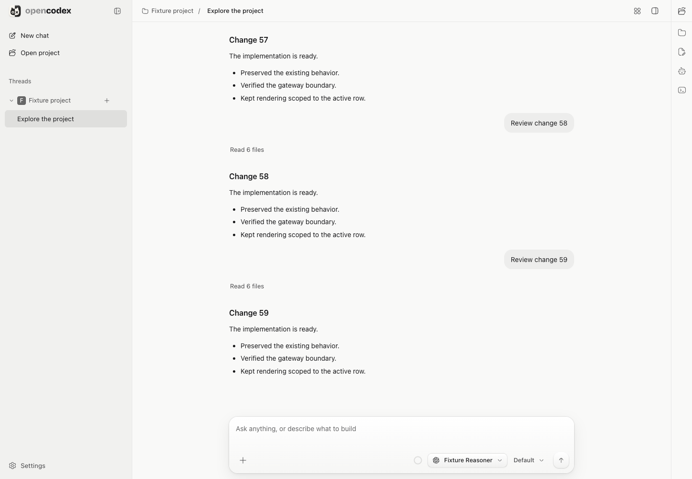
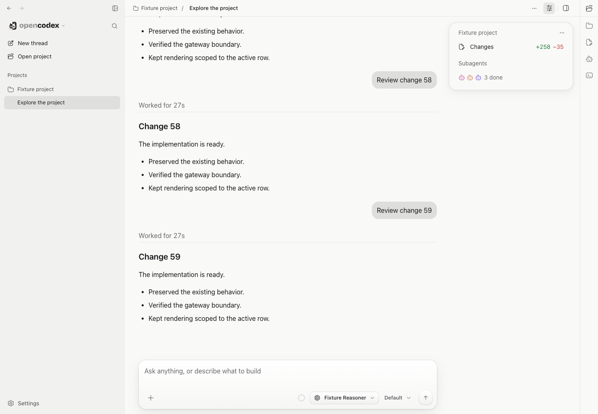
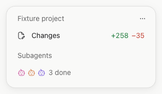
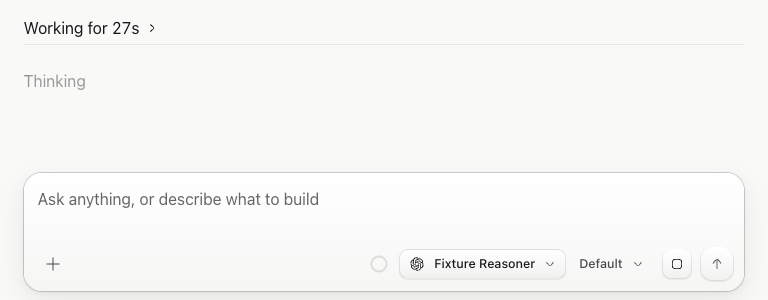
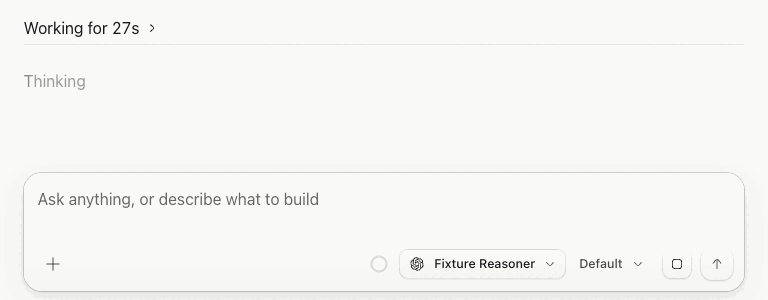

# Codex-style UI review visuals

These captures document the chat, sidebar, thread-summary, and native desktop changes. All prompts, files, projects, change totals, and child sessions are **synthetic protocol-fixture data**; the images do not show personal sessions or the actual diff statistics of this PR. No assets from the installed Codex/ChatGPT application are included.

## Before / after

Both captures use the same fixture, light theme, and 1444 × 1000 browser viewport. The baseline is `main` at [`3f0c4c9`](https://github.com/KMKoushik/opencodex/commit/3f0c4c9); it was built separately without changing the working implementation. The transcript is intentionally at its end in both captures, so the larger typography changes how much preceding content is visible.

| Before                                                                                                                    | After                                                                                                                             |
| ------------------------------------------------------------------------------------------------------------------------- | --------------------------------------------------------------------------------------------------------------------------------- |
|  |  |

## Focused details





<details>
<summary>Motion preview: active Thinking shimmer, hover chevron, and work disclosure</summary>



The elapsed clock is held at 27 seconds for a reproducible preview; the CSS animation and mouse/click interactions are live. This is not a recording of an agent executing real work. The app disables the shimmer for reduced-motion and forced-color modes; the static image above provides a non-animated preview.

</details>

## Additional states

| Capture                                    | What to inspect                                                                                                                                                |
| ------------------------------------------ | -------------------------------------------------------------------------------------------------------------------------------------------------------------- |
| [Wide layout, light](gutter-light.png)     | The 300px card occupies spare space without shifting the centered transcript/composer.                                                                         |
| [Wide layout, dark](gutter-dark.png)       | Theme-derived card, typography, bubbles, and change colors.                                                                                                    |
| [Narrow layout](mobile.png)                | Native popover; mixed done/failed child outcomes; no horizontal page overflow.                                                                                 |
| [Expanded activity](activity-expanded.png) | Work disclosure, reasoning/tool labels, and on-demand tool output within the virtualized transcript.                                                           |
| [Electron renderer](electron.png)          | Shared UI with the saved desktop theme and existing installed-application bridge. Native OS menus are validated by the Electron smoke test, not pictured here. |

Wide and narrow captures come from `tests/smoke.spec.ts`. The Electron image is a renderer screenshot; it is not a capture of the whole macOS desktop. The before/after and focused captures use the same protocol fixture through a temporary capture harness; that harness and its detached baseline build are not runtime dependencies or shipped code.

## Recheck the behavior

```sh
bun run build
bunx playwright test tests/smoke.spec.ts
```

For manual review, run **either** `bun dev` **or** `bun dev:desktop`, not both at once. Resize with the sidebar/workspace open and closed, switch light/dark themes, open the summary's Changes/Subagents rows, and dismiss the project menu with Escape before dismissing the summary. On desktop, select composer text and right-click to inspect native editing/spelling actions.

The review images are descriptive artifacts, not pixel-perfect snapshot assertions. The tests cover behavior, native boundaries, failure visibility, pagination, and bounded rendering; they do not require these exact fixture numbers or colors.
